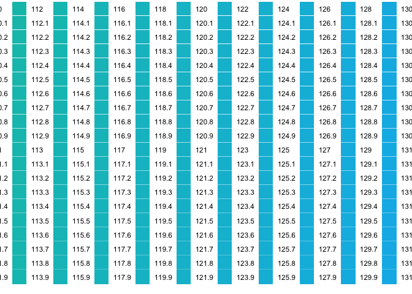

droughts
================
Gracie Goheen
2020-03-09

  - [Clean the data](#clean-the-data)
  - [Plot](#plot)

``` r
# Libraries
library(tidyverse)
library(sf)

# Parameters
  # Rainfall .grid file for December 2019
rainfall_dec19_raw <- "/Users/graciegoheen/Downloads/dcl/own/rainfall/2019120120191231.grid"
  # Geometry data for countries
countries_data <- "/Users/graciegoheen/Downloads/dcl/ne_110m_admin_0_countries/ne_110m_admin_0_countries.shp"
#===============================================================================


countries <- read_sf(dsn = countries_data)
australia <- 
  countries %>% 
  filter(NAME == "Australia")
```

## Clean the data

``` r
rainfall_dec19_matrix <- 
  rainfall_dec19_raw %>% 
  read_delim(
    delim = " ", 
    col_names = FALSE, 
    na = "99999.90", 
    trim_ws = TRUE, 
    skip = 6, 
    n_max = 691) %>% 
  select(-X887) %>% 
  as.matrix()
```

    ## Parsed with column specification:
    ## cols(
    ##   .default = col_double(),
    ##   X887 = col_logical()
    ## )

    ## See spec(...) for full column specifications.

``` r
rainfall_dec19 <-
  crossing(i = 1:691, j = 1:886) %>% 
  mutate(
    rainfall = map2_dbl(i, j, ~ rainfall_dec19_matrix[.x,.y]),
    lat = -44.500 + 0.050 * 691 - 0.050 * i,
    long = 112.000 + 0.050 * j
  ) %>%
  select(long, lat, rainfall)
```

## Plot

``` r
rainfall_dec19 %>% 
  ggplot() +
  geom_raster(aes(x = long, y = lat, fill = factor(rainfall)))
```

<!-- -->
