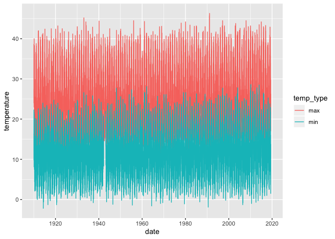
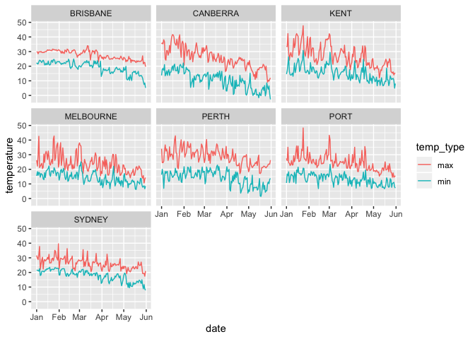
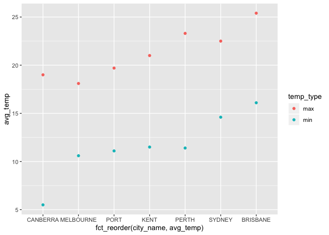
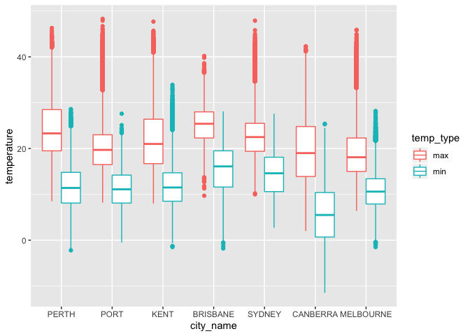
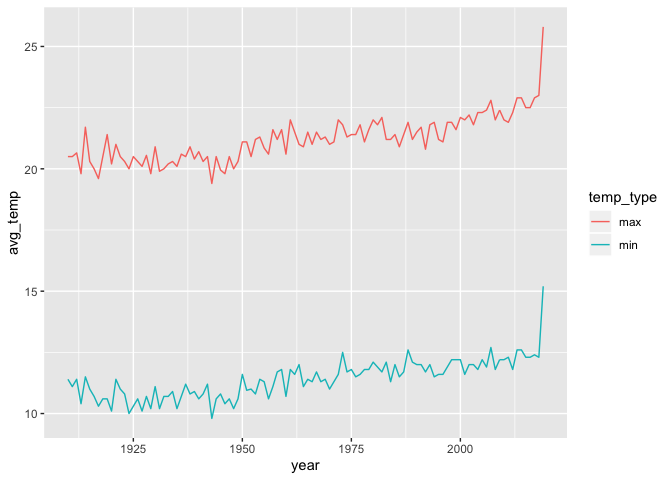
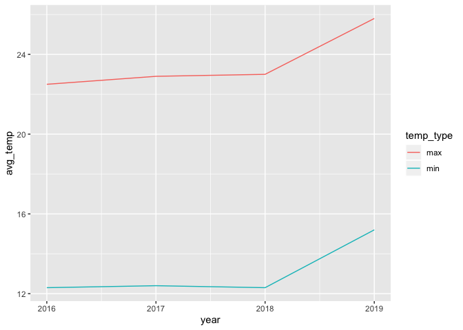
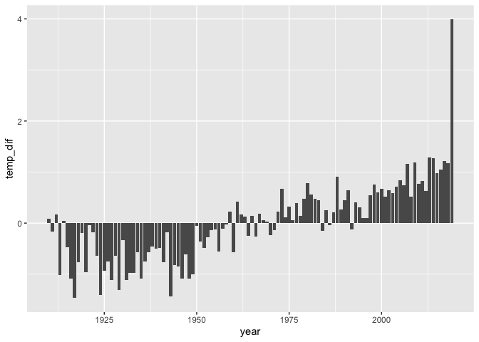
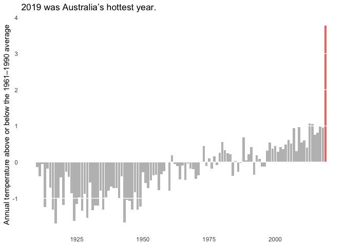

temperature
================
Gracie Goheen
2020-02-04

  - [Temperature by City](#temperature-by-city)

``` r
# Libraries
library(tidyverse)
library(lubridate)

# Parameters
temperature_data <- here::here("c01-own/data/temperature.rds")
temperature <- read_rds(temperature_data)
#===============================================================================
```

## Temperature by City

``` r
summary(temperature)
```

    ##   city_name              date             temperature     temp_type        
    ##  Length:528278      Min.   :1910-01-01   Min.   :-11.5   Length:528278     
    ##  Class :character   1st Qu.:1940-09-06   1st Qu.: 11.1   Class :character  
    ##  Mode  :character   Median :1967-10-04   Median : 16.3   Mode  :character  
    ##                     Mean   :1966-11-09   Mean   : 16.6                     
    ##                     3rd Qu.:1993-08-02   3rd Qu.: 21.6                     
    ##                     Max.   :2019-05-31   Max.   : 48.3                     
    ##                                          NA's   :3465                      
    ##   site_name        
    ##  Length:528278     
    ##  Class :character  
    ##  Mode  :character  
    ##                    
    ##                    
    ##                    
    ## 

``` r
sum(is.na(temperature))
```

    ## [1] 3465

``` r
temperature %>% 
  count(city_name)
```

    ## # A tibble: 7 x 2
    ##   city_name     n
    ##   <chr>     <int>
    ## 1 BRISBANE  51128
    ## 2 CANBERRA  77526
    ## 3 KENT      79924
    ## 4 MELBOURNE 79926
    ## 5 PERTH     79926
    ## 6 PORT      79924
    ## 7 SYDNEY    79924

``` r
temperature %>% 
  mutate(date = ymd(date)) %>% 
  filter(year(date) == 2019)
```

    ## # A tibble: 2,114 x 5
    ##    city_name date       temperature temp_type site_name    
    ##    <chr>     <date>           <dbl> <chr>     <chr>        
    ##  1 PERTH     2019-01-01        34.1 max       PERTH AIRPORT
    ##  2 PERTH     2019-01-02        24.6 max       PERTH AIRPORT
    ##  3 PERTH     2019-01-03        24.5 max       PERTH AIRPORT
    ##  4 PERTH     2019-01-04        25.5 max       PERTH AIRPORT
    ##  5 PERTH     2019-01-05        32.7 max       PERTH AIRPORT
    ##  6 PERTH     2019-01-06        36.7 max       PERTH AIRPORT
    ##  7 PERTH     2019-01-07        32.5 max       PERTH AIRPORT
    ##  8 PERTH     2019-01-08        33.9 max       PERTH AIRPORT
    ##  9 PERTH     2019-01-09        31.5 max       PERTH AIRPORT
    ## 10 PERTH     2019-01-10        26.1 max       PERTH AIRPORT
    ## # … with 2,104 more rows

``` r
temperature %>% 
  top_n(n = 1, wt = temperature)
```

    ## # A tibble: 1 x 5
    ##   city_name date       temperature temp_type site_name       
    ##   <chr>     <date>           <dbl> <chr>     <chr>           
    ## 1 PORT      2019-01-24        48.3 max       PORT LINCOLN AWS

``` r
temperature %>% 
  mutate(
    date = ymd(date),
    year = year(date)
  ) %>% 
  count(year) %>% 
  arrange(desc(year))
```

    ## # A tibble: 110 x 2
    ##     year     n
    ##    <dbl> <int>
    ##  1  2019  2114
    ##  2  2018  5110
    ##  3  2017  5110
    ##  4  2016  5124
    ##  5  2015  5110
    ##  6  2014  5110
    ##  7  2013  5110
    ##  8  2012  5124
    ##  9  2011  5110
    ## 10  2010  5110
    ## # … with 100 more rows

``` r
temperature %>% 
  filter(city_name == "PERTH") %>% 
  ggplot(aes(date, temperature, color = temp_type)) +
  geom_line()
```

<!-- -->

``` r
temperature %>% 
  mutate(date = ymd(date)) %>% 
  filter(
    year(date) == 2019, 
  ) %>% 
  ggplot(aes(date, temperature, color = temp_type)) +
  geom_line() +
  facet_wrap(vars(city_name))
```

<!-- -->

``` r
temperature %>% 
  group_by(city_name, temp_type) %>% 
  summarise(avg_temp = median(temperature, na.rm = TRUE)) %>% 
  ggplot(aes(fct_reorder(city_name, avg_temp), avg_temp, color = temp_type)) +
  geom_point()
```

<!-- -->

``` r
temperature %>% 
  mutate(
    city_name = as_factor(city_name)
  ) %>% 
  ggplot(aes(city_name, temperature, color = temp_type)) +
  geom_boxplot(position = "dodge")
```

    ## Warning: Removed 3465 rows containing non-finite values (stat_boxplot).

<!-- -->

``` r
temperature %>% 
  mutate(
    year = year(date)
  ) %>% 
  group_by(year, temp_type) %>% 
  summarise(avg_temp = median(temperature, na.rm = TRUE)) %>%
  ggplot(aes(year, avg_temp, color = temp_type)) +
  geom_line()
```

<!-- -->

``` r
temperature %>% 
  mutate(
    year = year(date)
  ) %>% 
  filter(year %in% c(2016:2019)) %>% 
  group_by(year, temp_type) %>% 
  summarise(avg_temp = median(temperature, na.rm = TRUE)) %>%
  ggplot(aes(year, avg_temp, color = temp_type)) +
  geom_line()
```

<!-- -->

``` r
# Attempt to recreate the New York Times "2019 was Australia’s hottest year" graph.

temperature %>% 
  drop_na() %>% 
  mutate(year = year(date)) %>% 
  group_by(year) %>% 
  summarise(temp_year = mean(temperature)) %>% 
  mutate(
    avg_temp = mean(temp_year),
    temp_dif = temp_year - avg_temp
  ) %>% 
  ggplot(aes(year, temp_dif)) +
  geom_col()
```

<!-- -->

``` r
# Attempt to recreate the New York Times "2019 was Australia’s hottest year" graph.

# The 1961–1990 average temperature
avg_temp_range <- 
  temperature %>% 
  drop_na() %>% 
  mutate(year = year(date)) %>% 
  filter(year %in% c(1961:1990)) %>% 
  summarize(mean(temperature))

temp_2019 <-
  temperature %>% 
  drop_na() %>% 
  mutate(year = year(date)) %>% 
  group_by(year) %>% 
  summarise(temp_year = mean(temperature)) %>% 
  mutate(
    temp_dif =  temp_year - as.double(avg_temp_range)
  ) %>% 
  filter(year == 2019)

temperature %>% 
  drop_na() %>% 
  mutate(year = year(date)) %>% 
  group_by(year) %>% 
  summarise(temp_year = mean(temperature)) %>% 
  mutate(
    temp_dif =  temp_year - as.double(avg_temp_range)
  ) %>% 
  ggplot(aes(year, temp_dif)) +
  geom_col(fill = "grey") +
  geom_col(data = temp_2019, aes(year, temp_dif, fill = "red")) +
  theme(
    axis.title.x = element_blank(),
    axis.ticks = element_blank(),
    legend.position = "none",
    panel.background = element_rect(fill = "transparent"),
    panel.grid = element_line(color = "transparent"),
    panel.grid.major.y = element_line(color = "White"),
    panel.ontop = TRUE
  ) +
  labs(
    title = "2019 was Australia’s hottest year.",
    y = "Annual temperature above or below the 1961–1990 average"
  )
```

<!-- -->

Something seems to be wrong with my data, because my graph looks very
different. I also need to figure out how to do the y scale and caption /
arrows.
