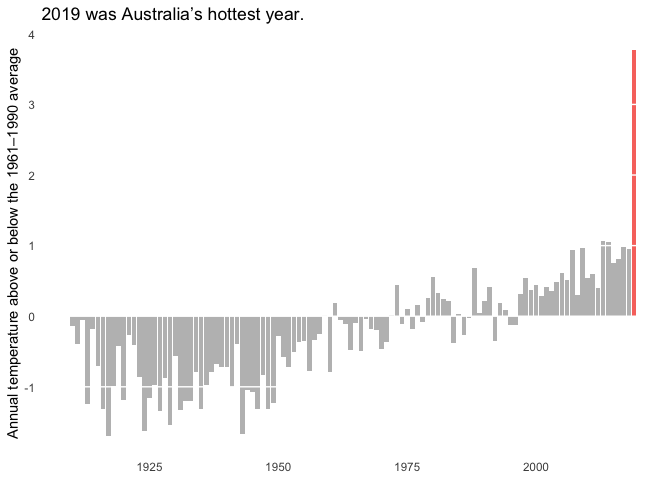
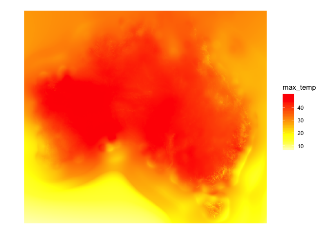

Progress report 2
================
Gracie Goheen
2020-02-19

  - [EDA](#eda)

``` r
# Libraries
library(tidyverse)
library(lubridate)
library(leaflet)
library(leaflet.extras)
library(sf)

# Parameters
temperature_data <- here::here("c01-own/data/temperature.rds")
temperature <- read_rds(temperature_data)

nasa_fire <- readr::read_csv('https://raw.githubusercontent.com/rfordatascience/tidytuesday/master/data/2020/2020-01-07/MODIS_C6_Australia_and_New_Zealand_7d.csv')

countries_data <- "/Users/graciegoheen/Downloads/dcl/ne_110m_admin_0_countries/ne_110m_admin_0_countries.shp"
countries <- read_sf(dsn = countries_data)
australia <- countries %>% filter(NAME == "Australia")
max_temp_raw <- "/Users/graciegoheen/Downloads/dcl/own/2019122920191229.grid"
max_temp <- 
  max_temp_raw %>% 
  read_delim(
    delim = " ", 
    col_names = FALSE, 
    na = "99999.90", 
    trim_ws = TRUE, 
    skip = 6, 
    n_max = 691) %>% 
  # Is there a better way to get rid of column of NAs?
  select(-X887) %>% 
  as.matrix()
max_temp_clean <-
  crossing(i = 1:691, j = 1:886) %>% 
  mutate(
    max_temp = map2_dbl(i, j, ~ max_temp[[.x,.y]]),
    lat = -44.500 + 0.050 * 691 - 0.050 * i,
    long = 112.000 + 0.050 * j
  ) %>%
  select(long, lat, max_temp)
#===============================================================================
```

## EDA

``` r
# Attempt to recreate the New York Times "2019 was Australia’s hottest year" graph.

# The 1961–1990 average temperature
avg_temp_range <- 
  temperature %>% 
  drop_na() %>% 
  mutate(year = year(date)) %>% 
  filter(year %in% c(1961:1990)) %>% 
  summarize(mean(temperature))

temp_2019 <-
  temperature %>% 
  drop_na() %>% 
  mutate(year = year(date)) %>% 
  group_by(year) %>% 
  summarise(temp_year = mean(temperature)) %>% 
  mutate(
    temp_dif =  temp_year - as.double(avg_temp_range)
  ) %>% 
  filter(year == 2019)

temperature %>% 
  drop_na() %>% 
  mutate(year = year(date)) %>% 
  group_by(year) %>% 
  summarise(temp_year = mean(temperature)) %>% 
  mutate(
    temp_dif =  temp_year - as.double(avg_temp_range)
  ) %>% 
  ggplot(aes(year, temp_dif)) +
  geom_col(fill = "grey") +
  geom_col(data = temp_2019, aes(year, temp_dif, fill = "red")) +
  theme(
    axis.title.x = element_blank(),
    axis.ticks = element_blank(),
    legend.position = "none",
    panel.background = element_rect(fill = "transparent"),
    panel.grid = element_line(color = "transparent"),
    panel.grid.major.y = element_line(color = "White"),
    panel.ontop = TRUE
  ) +
  labs(
    title = "2019 was Australia’s hottest year.",
    y = "Annual temperature above or below the 1961–1990 average"
  )
```

<!-- -->

``` r
# Points represent any detection of fire, not actual area burned. 

# nasa_fire %>%
#   leaflet() %>%
#   addProviderTiles(providers$CartoDB.Positron) %>%
#   addCircles(lng = ~longitude, lat = ~latitude, radius = ~brightness, color = "red")

# My file won't knit with this.
```

``` r
australia %>% 
  ggplot() +
  geom_sf() +
  geom_raster(data = max_temp_clean, aes(x = long, y = lat, fill = max_temp)) +
  scale_fill_gradientn(colors = heat.colors(9, rev = TRUE)) +
  theme_void() 
```

<!-- -->

``` r
# How do I use st_intersection to get coordinates just inside austrailia.

# max_temp_aus_only <-
#   max_temp_clean %>% 
#   st_as_sf(coords = c("long", "lat"), crs = 4326) %>% 
#   st_intersection(australia)
```

I am also trying to figure out gganimate, for a time evolution graph.
