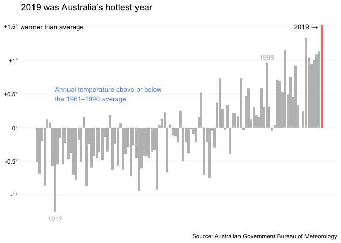
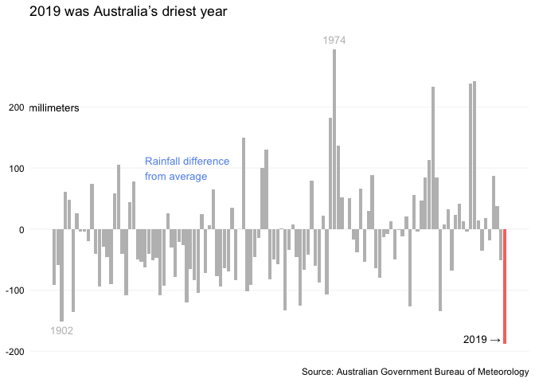
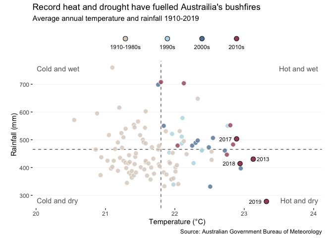
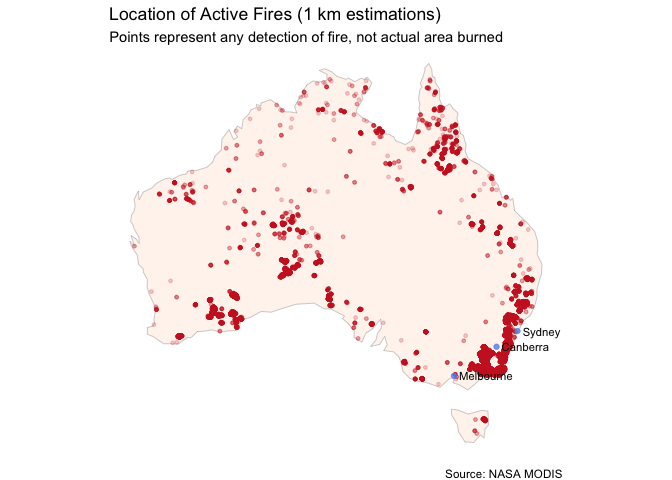
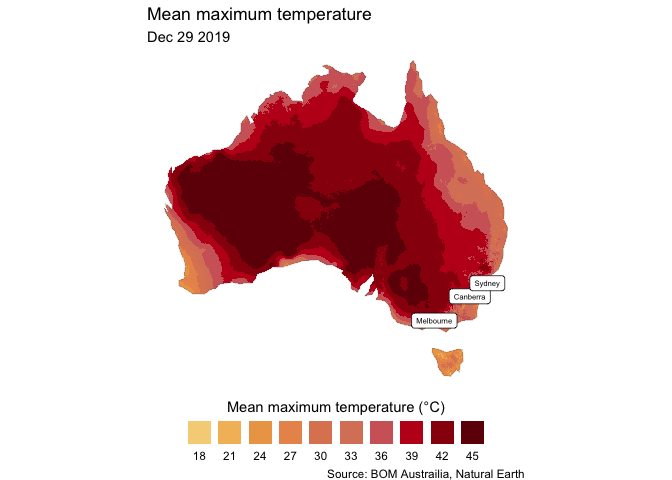

Final report
================
Gracie Goheen
2020-03-12

``` r
knitr::opts_chunk$set(echo = TRUE)
```

Austrailia’s most recent fire season was one of the most extreme in its
history, with around 11m hectares burnt and over than 120 fires still
raging as of January 21st. This total area is more than five times the
area destroyed by the 2018 California wildfires. More than 20% of
Austrailia’s forest has been destroyed and many highly-populated areas
have faced severe burning. According to [The
Guardian](https://www.theguardian.com/australia-news/datablog/ng-interactive/2019/dec/07/how-big-are-the-fires-burning-on-the-east-coast-of-australia-interactive-map),
“this season’s bushfires in south-eastern Australia have killed at least
32 people and destroyed almost 2,000 homes in New South Wales, Victoria
and South Australia.”

So, why was this year so bad for bushfires in Australia?

Note: This project uses data from a [tidytuesday
challenge](https://github.com/rfordatascience/tidytuesday/blob/master/data/2020/2020-01-07/readme.md).

Source articles:

\*[Here’s Where Australia’s Destructive Wildfires Are Burning, New York
Times](https://www.nytimes.com/interactive/2020/01/02/climate/australia-fires-map.html)

\*[Australia fires: A visual guide to the bushfire crisis, BBC
News](https://www.bbc.com/news/world-australia-50951043)

\*[Australia’s deadly wildfires in numbers, Financial
Times](https://www.ft.com/content/c068339e-3c55-11ea-b232-000f4477fbca)

``` r
temp_2019 <-
  temp_anon %>% 
  filter(year == 2019)

temp_anon %>% 
  ggplot(aes(year, temp_anomaly_c)) +
  geom_col(fill = "grey") +
  geom_col(data = temp_2019, aes(year, temp_anomaly_c, fill = color_2019)) +
  scale_y_continuous(
    breaks = seq(-1, 1.5, 0.5),
    labels = c("-1°", "-0.5°", "0°", "+0.5°", "+1°", "+1.5°")
  ) +
  annotate(
    "text",
    x = c(2013, 1998, 1917, 1915.8, 1917),
    y = c(1.5, 1.05, -1.35, 1.5, 0.5),
    label = 
      c(
        "2019 →", 
        "1998", 
        "1917", 
        "warmer than average", 
        "Annual temperature above or below \nthe 1961–1990 average"
        ),
    color = c("black", "gray", "gray", "black", "cornflowerblue"),
    hjust = c(0.5, 0.5, 0.5, 0.5, 0),
    size = 3.5
  ) +
  theme(
    axis.title.x = element_blank(),
    axis.text.x = element_blank(),
    axis.text.y = element_text(color = "black"),
    axis.ticks = element_blank(),
    legend.position = "none",
    panel.background = element_rect(fill = "transparent"),
    panel.grid = element_line(color = "transparent"),
    panel.grid.major.y = element_line(color = "gray97")
  ) +
  labs(
    title = "2019 was Australia’s hottest year",
    x = NULL,
    y = NULL,
    caption = "Source: Australian Government Bureau of Meteorology"
  )
```

<!-- -->

``` r
rain_2019 <-
  rain_anon %>% 
  filter(year == 2019)

rain_anon %>% 
  ggplot(aes(year, rainfall_anomaly_mm)) +
  geom_col(fill = "grey") +
  geom_col(data = rain_2019, aes(year, rainfall_anomaly_mm, fill = color_2019)) +
  scale_y_continuous(
    breaks = seq(-200, 200, 100),
    labels = c("-200", "-100", "0", "100", "200")
  ) +
  annotate(
    "text",
    x = c(2013, 1974, 1902, 1900, 1924),
    y = c(-180, 310, -165, 200, 100), 
    label = 
      c(
        "2019 →",
        "1974",
        "1902",
        "millimeters",
        "Rainfall difference \nfrom average"
      ),
    color = c("black", "gray", "gray", "black", "cornflowerblue"),
    hjust = c(0.5, 0.5, 0.5, 0.5, 0),
    size = 3.5
  ) +
  theme(
    axis.title.x = element_blank(),
    axis.text.x = element_blank(),
    axis.text.y = element_text(color = "black"),
    axis.ticks = element_blank(),
    legend.position = "none",
    panel.background = element_rect(fill = "transparent"),
    panel.grid = element_line(color = "transparent"),
    panel.grid.major.y = element_line(color = "gray97")
  ) +
  labs(
    title = "2019 was Australia’s driest year",
    x = NULL,
    y = NULL,
    caption = "Source: Australian Government Bureau of Meteorology"
  )
```

<!-- -->

The ideal conditions for the spread of wildfires are a hot and dry
climate matched with strong winds. 2019 was both the hotest and driest
year on record for Austrailia.

``` r
temp_total <-
  temp_anon %>% 
  mutate(temp_c = temp_anomaly_c + temp_avg) %>% 
  left_join(
    y = rain_total,
    by = "year"
  ) %>% 
  mutate(
    year_range = 
      case_when(
        year < 1990 ~ "1910-1980s",
        year < 2000 ~ "1990s",
        year < 2010 ~ "2000s",
        year < 2020 ~ "2010s"
      )
  )

top_temp_recent <-
  temp_total %>% 
  filter(year > 2010) %>% 
  top_n(temp_c, n = 4)

temp_total %>% 
  ggplot(aes(temp_c, rainfall_mm, fill = factor(year_range))) +
  geom_hline(yintercept = rain_avg, color = "gray40", linetype = "dashed") +
  geom_vline(xintercept = temp_avg, color = "gray40", linetype = "dashed") +
  geom_point(shape = 21, color = "white", size = 3, alpha = 0.8) +
  geom_point(shape = 21, color = "black", size = 3, data = top_temp_recent) +
  ggrepel::geom_text_repel(
    aes(label = year),
    data = top_temp_recent,
    size = 3,
    nudge_x = c(-0.25, -0.25, 0.05, -0.25),
    hjust = 0
  ) +
  annotate(
    geom = "text",
    x = c(-Inf, Inf, Inf, -Inf),
    y = c(Inf, Inf, -Inf, -Inf),
    label = c("Cold and wet", "Hot and wet", "Hot and dry", "Cold and dry"),
    hjust = c(-0.1, 1.1, 1.1, -0.1),
    vjust = c(2, 2, -1, -1),
    color = "gray40"
  ) +
  scale_x_continuous(expand = expand_scale(add = c(0.6, 0.8))) +
  scale_fill_manual(
    values = range_colors
  ) +
  coord_fixed(ratio = 0.004) +
  guides(
    fill = 
      guide_legend(
        title.position = "top", 
        title.hjust = 0.5, 
        label.position = "bottom", 
        nrow = 1)
  ) +
  theme(
    legend.position = "top",
    legend.spacing.x = unit(1.0, "cm"),
    legend.key = element_blank(),
    legend.text = element_text(margin = margin(t = -5)),
    panel.background = element_rect(fill = "transparent"),
    panel.grid = element_line(color = "transparent"),
    panel.grid.major.y = element_line(color = "gray97"),
    panel.grid.minor = element_blank()
  ) +
  labs(
    title = "Record heat and drought have fuelled Austrailia's bushfires",
    subtitle = "Average annual temperature and rainfall 1910-2019",
    x = "Temperature (°C)",
    y = "Rainfall (mm)",
    fill = NULL,
    caption = "Source: Australian Government Bureau of Meteorology"
  ) 
```

<!-- -->

Drought and heatwaves are becoming more and more prevelant. Looking
towards Austrailia’s next fire season, there is a growing risk that
fires of this magnitude could happen again.

``` r
nasa_fire_aus_only <-
  st_intersection(
    x = nasa_fire %>% st_as_sf(coords = c("longitude", "latitude"), crs = 4326) ,
    y = australia
  )
```

    ## although coordinates are longitude/latitude, st_intersection assumes that they are planar

    ## Warning: attribute variables are assumed to be spatially constant throughout all
    ## geometries

``` r
nasa_fire_aus_only %>% 
  transmute(
    longitude = st_coordinates(geometry) %>% as_tibble() %>% pull(X),
    latitude = st_coordinates(geometry) %>% as_tibble() %>% pull(Y)
  ) %>% 
  ggplot() +
  geom_sf(data = australia, size = 0.1, fill = "seashell") +
  geom_point(
    aes(x = longitude, y = latitude), 
    color = "firebrick3", 
    size = 1, 
    alpha = 0.2
  ) +
  geom_sf(data = aus_places, color = "cornflowerblue", alpha = 0.8) +
  geom_sf_text(
    aes(label = NAME),
    size = 3,
    data = aus_places,
    nudge_x = 0.5,
    hjust = 0
  ) +
  theme_void() +
  labs(
    title = "Location of Active Fires (1 km estimations)",
    subtitle = "Points represent any detection of fire, not actual area burned",
    caption = "Source: NASA MODIS"
  )
```

    ## Warning in st_point_on_surface.sfc(sf::st_zm(x)): st_point_on_surface may not
    ## give correct results for longitude/latitude data

<!-- -->

Many of these active fires have been concentrated in New South Wales -
one of the most populated parts of Austrailia.

``` r
max_temp_aus_only <-
  st_intersection(
    x = max_temp %>% st_as_sf(coords = c("long", "lat"), crs = 4326) ,
    y = australia
  )
```

    ## although coordinates are longitude/latitude, st_intersection assumes that they are planar

    ## Warning: attribute variables are assumed to be spatially constant throughout all
    ## geometries

``` r
max_temp_aus_only %>% 
  transmute(
    max_temp = pmin(45, 3 * round(max_temp / 3)),
    long = st_coordinates(geometry) %>% as_tibble() %>% pull(X),
    lat = st_coordinates(geometry) %>% as_tibble() %>% pull(Y)
  ) %>% 
  ggplot() +
  geom_raster(aes(x = long, y = lat, fill = factor(max_temp))) +
  geom_sf(data = australia, size = 0.1, fill = NA) +
  geom_sf(data = aus_places, color = "white") +
  geom_sf_label(
    aes(label = NAME),
    size = 2,
    data = aus_places
  ) +
  scale_fill_manual(
    values = colors,
    breaks = seq(18, 45, 3)
  ) +
  guides(
    fill = 
      guide_legend(
        title.position = "top", 
        title.hjust = 0.5, 
        label.position = "bottom", 
        nrow = 1)
  ) +
  theme_void() +
  theme(
    legend.position = "bottom",
    legend.direction = "horizontal"
  ) +
  labs(
    title = "Mean maximum temperature",
    subtitle = "Dec 29 2019",
    fill = "Mean maximum temperature (°C)", 
    caption = "Source: BOM Austrailia, Natural Earth"
  )
```

    ## Warning in st_point_on_surface.sfc(sf::st_zm(x)): st_point_on_surface may not
    ## give correct results for longitude/latitude data

    ## Warning in f(...): Raster pixels are placed at uneven vertical intervals and
    ## will be shifted. Consider using geom_tile() instead.

<!-- -->

Australia surpassed its all-time temperature record twice in December:
An average maximum of 40.9°C on December 17 and 41.9°C on December 18.
As the temperature continues to rise and rainfall becomes less frequent,
the elevated fire risk in Australia will continue.
